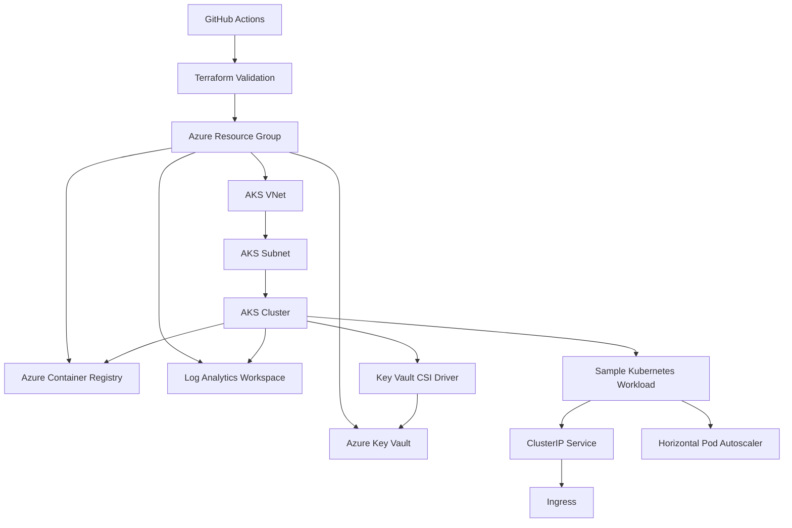

# AKS Platform with Terraform

[](https://github.com/ugochuk/aks-platform-terraform/actions/workflows/platform-ci.yml)

Production-minded Azure Kubernetes Service platform built with Terraform and Kubernetes manifests. The project demonstrates secure AKS infrastructure, managed identity, Azure CNI networking, workload identity, Key Vault CSI integration, Azure Policy, Log Analytics monitoring, autoscaling, ingress, and CI validation.

## What this project demonstrates

- Azure Kubernetes Service (AKS) provisioned with Terraform
- Azure CNI networking and dedicated AKS subnet
- System-assigned managed identity
- OIDC issuer and Microsoft Entra Workload Identity
- Azure Key Vault Secrets Store CSI integration
- Azure Policy add-on
- Log Analytics / Container Insights foundation
- Cluster autoscaler
- Azure Container Registry integration
- Kubernetes namespace, Deployment, Service, Ingress, and HPA manifests
- GitHub Actions validation for Terraform and Kubernetes YAML
- Infrastructure and workload separation

## Architecture



See [docs/architecture.md](docs/architecture.md) for the design decisions and production considerations.

## Repository structure

```text
.
├── .github/workflows/platform-ci.yml
├── docs/architecture.md
├── kubernetes/
│   ├── namespace.yaml
│   ├── deployment.yaml
│   ├── service.yaml
│   ├── ingress.yaml
│   └── hpa.yaml
├── terraform/
│   ├── main.tf
│   ├── outputs.tf
│   ├── providers.tf
│   ├── terraform.tfvars.example
│   ├── variables.tf
│   └── versions.tf
└── .gitignore
```

## Terraform usage

```bash
cd terraform
terraform init
terraform fmt -check -recursive
terraform validate
cp terraform.tfvars.example terraform.tfvars
terraform plan
```

## Kubernetes manifests

After provisioning the cluster and obtaining credentials:

```bash
az aks get-credentials \
  --resource-group <resource-group> \
  --name <cluster-name>

kubectl apply -f kubernetes/
```

The sample workload intentionally uses a public container image so the repository can focus on platform engineering rather than application development.

## Security design

The cluster enables OIDC and Workload Identity so applications can access Azure resources using federated identities instead of embedded credentials. Key Vault integration is enabled through the Secrets Store CSI provider. Azure Policy is enabled for Kubernetes governance, and AKS uses managed identity for Azure resource access.

## Portfolio note

This is an original portfolio implementation and contains no employer source code, customer information, cluster credentials, subscription IDs, tenant IDs, or proprietary architecture.
